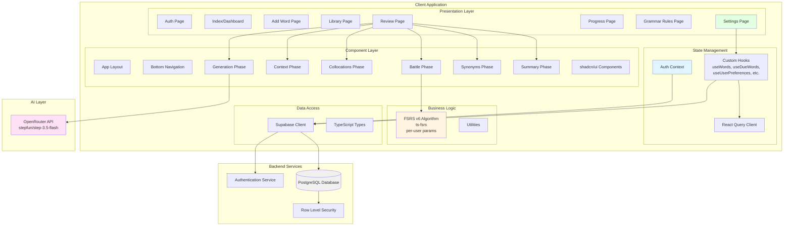
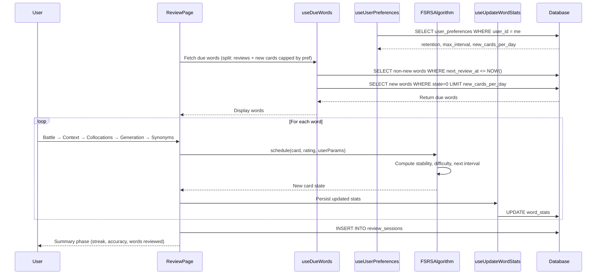
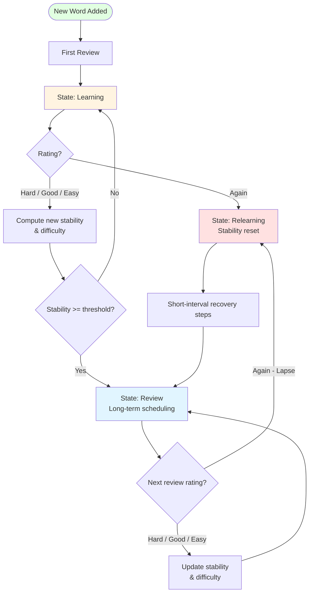
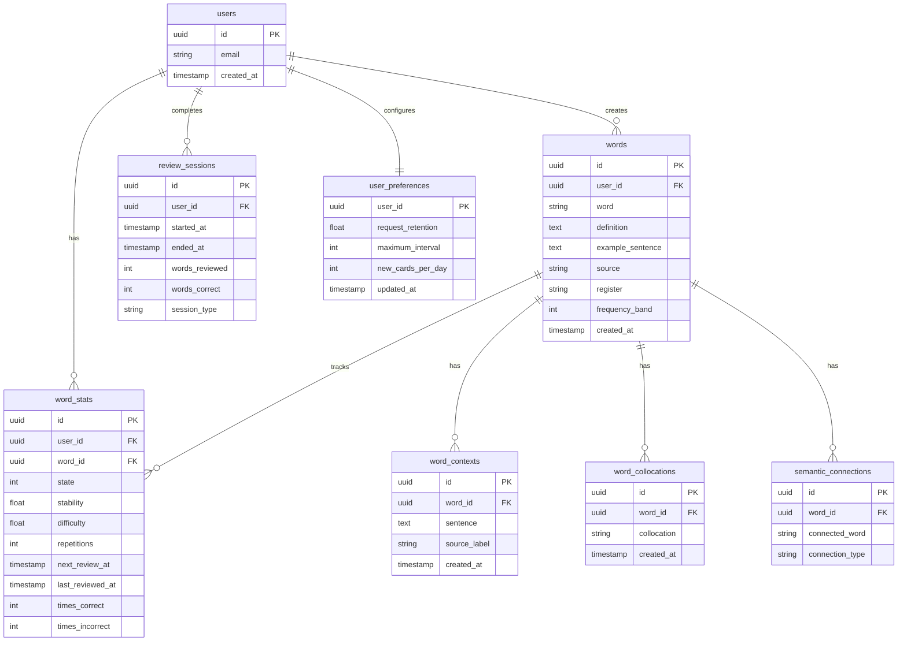
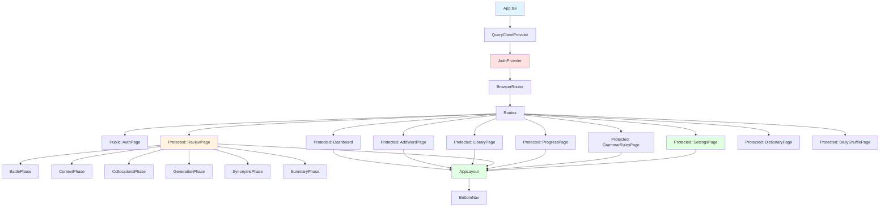

<div align="center">

# 🧠 LexCore

**Neuroscience-based vocabulary acquisition engine powered by FSRS spaced repetition and AI.**

[](https://reactjs.org/)
[](https://www.typescriptlang.org/)
[](https://supabase.com/)
[](https://tailwindcss.com/)
[](https://opensource.org/licenses/MIT)

[Demo](#) · [Report Bug](#) · [Request Feature](#)

</div>

---

## 🔍 What is LexCore?

LexCore is a vocabulary learning app built on the principle that the **brain doesn't memorize — it reconstructs**. Instead of passive flashcards, LexCore forces active recall through a **6-phase review session**, then uses the **FSRS v6 spaced repetition algorithm** to schedule each word at the precise moment before you'd forget it.

The competitive edge: an **AI-powered sentence scoring pipeline** that evaluates your own generated sentences — making your review data trustworthy and pushing you toward real production of the word.

---

## ✨ Features

- ⚔️ **Battle Phase** — 4-choice cloze test before definition reveal. Forces recall, not recognition.
- 📖 **Context Phase** — Read real example sentences, fill in the blank.
- 🔗 **Collocation Phase** — Review natural word pairings and usage patterns.
- ✍️ **Generation Phase** — Write your own sentence; AI scores it on the spot.
- 🔄 **Synonyms Phase** — Review semantically related words to build a richer mental web.
- 🤖 **AI Auto-Scoring** — OpenRouter-powered sentence evaluation. No self-rating bias.
- 🔁 **FSRS v6 Spaced Repetition** — State-machine scheduling (New → Learning → Review → Relearning) driven by actual memory stability, not fixed intervals.
- 🌙 **Sleep Prep Mode** — Evening review session (8 PM–3 AM) that leverages sleep consolidation.
- 📚 **Word Library** — Add words with definitions, collocations, synonyms, and emotion anchors. Claude auto-generates content.
- 📊 **Progress Dashboard** — Streak tracking, 7-day velocity chart, mastered word count, and due-today count.
- ⚙️ **User Settings** — Per-user FSRS tuning: retention target (70–97%), max interval, and new cards/day cap — all with plain-language "How it works" explanations inline.
- 🔐 **Auth & RLS** — Row-level security so your data stays yours.
- 📖 **Oxford 3000 Dictionary** — Browse all 3000 Oxford words in a 3-column library card grid. Filter by CEFR level, part of speech, and alphabet. Words already in your library are visually marked as conquered (dimmed, strikethrough, teal border + checkmark).
- 🎲 **Daily Shuffle** — Date-seeded daily word discovery engine. Pick a CEFR level and part of speech, set how many words you want (1–50), and get a fresh randomized batch every day — excluding words you've already conquered. Paginate through the full pool with Prev / Next.
- 🧠 **AI Intelligence Tips** — On the Daily Shuffle page, tap Tips to get a live AI-generated intelligence report: why learning your chosen POS at your chosen CEFR level matters, the optimal strategy, and a power insight most learners don't know.

---

## 🛠️ Tech Stack

| Layer | Technology |
|---|---|
| Frontend | React 18.3, TypeScript, Vite |
| Routing | React Router v6 |
| Data Fetching | TanStack Query |
| Styling | Tailwind CSS, shadcn/ui, Framer Motion |
| Backend | Supabase (PostgreSQL + Auth + RLS) |
| AI Scoring | OpenRouter (`stepfun/step-3.5-flash`) |
| Algorithm | FSRS v6 (`ts-fsrs`) — user-configurable retention target (default 90%) |
| Build | Vite, Bun |

---

## 🏗️ Architecture

### System Overview



---

### Review Session Flow



---

### FSRS v6 State Machine



**FSRS parameters** are now configurable per-user via the Settings page:

| Parameter | Default | Range | Description |
|---|---|---|---|
| `request_retention` | 90% | 70–97% | Target recall probability at review time |
| `maximum_interval` | 365 days | 30–730 days | Cap on scheduling gap for well-learned words |
| `new_cards_per_day` | 10 | 1–30 | Max new words introduced per session |
| `enable_fuzz` | `true` | — | Jitter to prevent review clustering (always on) |

---

### Database Schema



---

### Component Hierarchy



---

## 🚀 Getting Started

### Prerequisites

- Node.js 18+ or Bun
- A Supabase project
- An OpenRouter API key

### Installation

```bash
# Clone the repo
git clone https://github.com/your-username/lexcore.git
cd lexcore

# Install dependencies
bun install
# or
npm install
```

### Environment Variables

Create a `.env` file in the root:

```env
VITE_SUPABASE_URL=your_supabase_url
VITE_SUPABASE_ANON_KEY=your_supabase_anon_key
VITE_OPENROUTER_API_KEY=your_openrouter_api_key
```

### Run Locally

```bash
bun dev
# or
npm run dev
```

Open [http://localhost:5173](http://localhost:5173) in your browser.

---

## 🗺️ Roadmap

### ✅ Shipped

- [x] FSRS v6 spaced repetition engine (`ts-fsrs`)
- [x] Battle phase — 4-choice cloze quiz
- [x] Context phase — example sentence cloze
- [x] Collocation phase — natural word pairings
- [x] Generation phase — write your own sentence
- [x] Synonyms phase — semantic network review
- [x] AI sentence scoring via OpenRouter
- [x] Word library with collocations, synonyms, emotion anchors
- [x] Claude-powered auto-generation of definitions and examples
- [x] Review session tracking and streak system
- [x] Sleep Prep mode (evening consolidation sessions)
- [x] User settings UI — retention target, new cards/day, max interval with inline plain-language help
- [x] Oxford 3000 Dictionary browser — 3-column card grid, CEFR / POS / alphabet filters
- [x] Conquered word marking in Dictionary — strikethrough, dimmed, teal border, checkmark, "already conquered" badge
- [x] Daily Shuffle — date-seeded daily word discovery, CEFR + POS filters, adjustable batch size (1–50), pagination
- [x] AI Intelligence Tips panel on Daily Shuffle — structured insight report per POS + CEFR combo (why it matters, strategy, power insight, focus score)

### 🔜 Up Next
- [ ] **Listening phase** — TTS pronunciation audio on every word card so you hear it while you review it
- [ ] **Forgetting curve visualizer** — per-word chart showing memory strength over time, so you can see exactly how a word was learned
- [ ] **Custom decks / topic lists** — group words into decks (IELTS Academic, Business English, Phrasal Verbs) and review them independently
- [ ] **Daily reminder notifications** — push or email nudge when you have words due, so you never miss a streak day
- [ ] **Bulk import** — paste a word list or upload a CSV / Anki `.apkg` file to seed your library fast
- [ ] **Writing journal** — a dedicated page showing every sentence you've ever generated, searchable and filterable by word

### 🔭 Future

- [ ] **Browser extension** — highlight any word on any webpage and save it to LexCore with one click, context sentence auto-captured
- [ ] **CEFR difficulty tagging** — each word automatically labelled A1–C2 so you can filter your library by level
- [ ] **Leaderboard & XP** — earn experience points per review session, compete with friends on a weekly leaderboard
- [ ] **Vocabulary analytics deep-dive** — see your hardest words by lapse count, stability distribution histogram, and predicted review load for the next 30 days
- [ ] **Multi-language support** — learn vocabulary in languages other than English (Spanish, French, Arabic, etc.)
- [ ] **Offline support (PWA)** — review words with no internet connection, sync when back online
- [ ] **Export vocabulary sets** — download your library as CSV, JSON, or Anki deck to use in other tools
- [ ] **Native mobile app** — React Native port for iOS and Android with background notification support

---

## 📁 Project Structure

```
lexcore/
├── src/
│   ├── components/        # Reusable UI components
│   │   ├── review/        # BattlePhase, ContextPhase, CollocationsPhase, etc.
│   │   └── ui/            # shadcn/ui components
│   ├── hooks/             # Custom React hooks (useWords, useDueWords, useUserPreferences, etc.)
│   ├── lib/               # FSRS algorithm (ts-fsrs), Supabase client, utilities
│   ├── pages/             # Route-level page components
│   │   ├── Index.tsx          # Dashboard
│   │   ├── ReviewPage.tsx     # 6-phase review session
│   │   ├── LibraryPage.tsx
│   │   ├── AddWordPage.tsx
│   │   ├── ProgressPage.tsx
│   │   ├── GrammarRulesPage.tsx
│   │   ├── DictionaryPage.tsx # Oxford 3000 browser with conquered-word marking
│   │   ├── DailyShufflePage.tsx # Date-seeded daily word discovery + AI Tips
│   │   └── SettingsPage.tsx   # Per-user FSRS configuration
│   ├── contexts/          # AuthContext
│   └── lib/types.ts       # TypeScript types
├── public/
├── .env.example
├── vite.config.ts
└── README.md
```

---

## 🤝 Contributing

Contributions are welcome. Please open an issue first to discuss what you'd like to change.

1. Fork the repo
2. Create your feature branch (`git checkout -b feature/your-feature`)
3. Commit your changes (`git commit -m 'add: your feature'`)
4. Push to the branch (`git push origin feature/your-feature`)
5. Open a Pull Request

---

## 📄 License

Distributed under the MIT License. See `LICENSE` for more information.

---

<div align="center">

Built by [Miraz](https://github.com/MirazZim) · Powered by neuroscience, not repetition.

</div>
