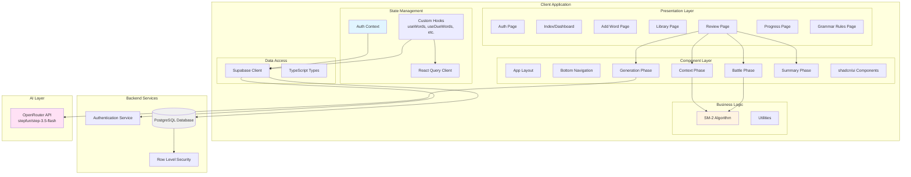
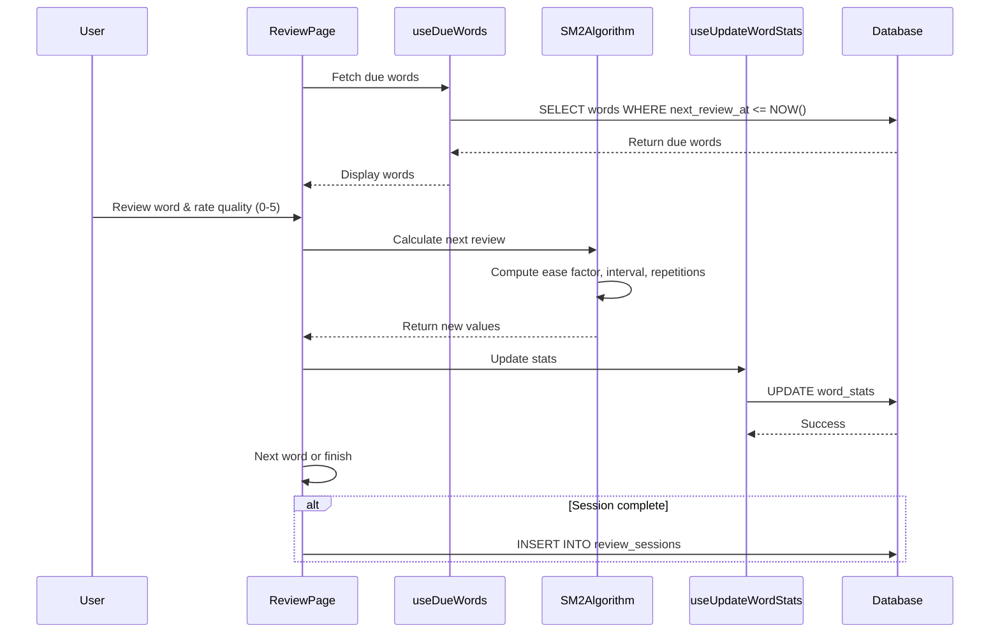
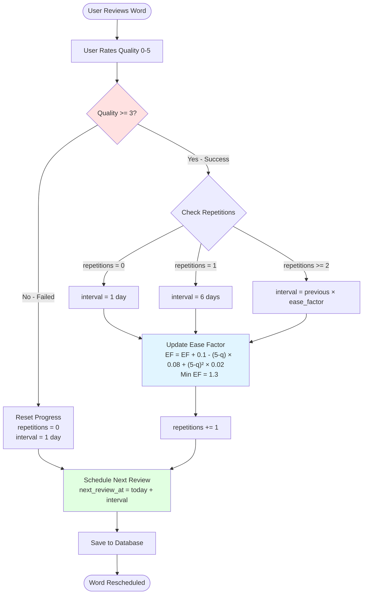
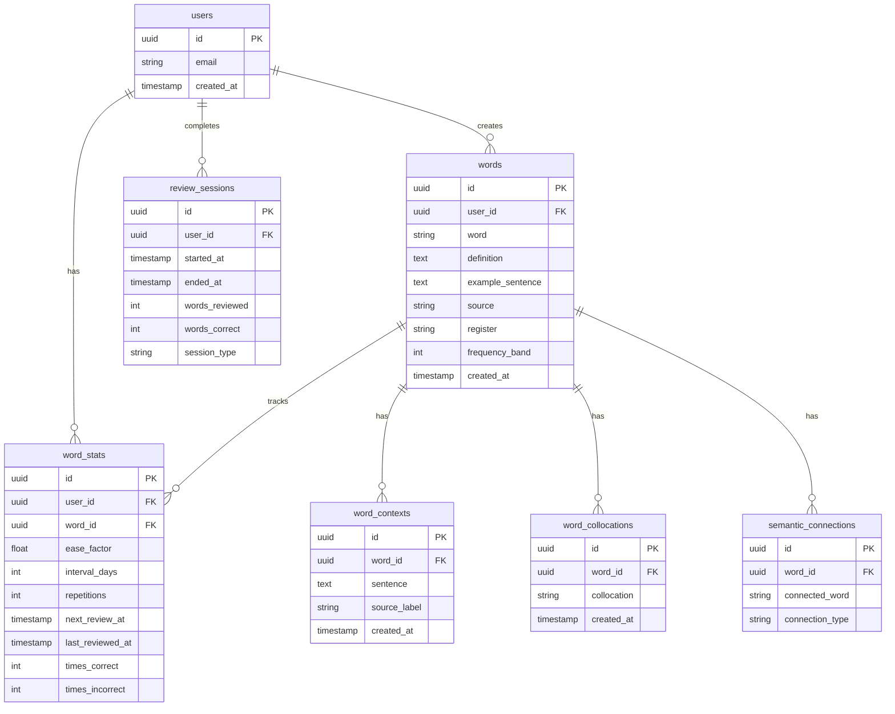
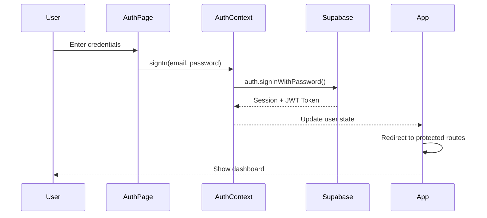
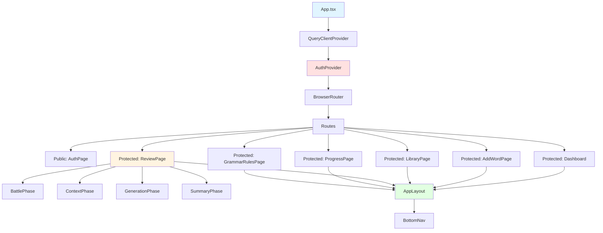

<div align="center">

# 🧠 LexCore

**Neuroscience-based vocabulary acquisition engine powered by spaced repetition and AI.**

[](https://reactjs.org/)
[](https://www.typescriptlang.org/)
[](https://supabase.com/)
[](https://tailwindcss.com/)
[](https://opensource.org/licenses/MIT)

[Demo](#) · [Report Bug](#) · [Request Feature](#)

</div>

---

## 🔍 What is LexCore?

LexCore is a vocabulary learning app built on the principle that the **brain doesn't memorize — it reconstructs**. Instead of passive flashcards, LexCore forces active recall through a **battle mode** quiz system, then uses the **SM-2 spaced repetition algorithm** to schedule each word at the precise moment before you'd forget it.

The competitive edge: an **AI-powered auto-scoring pipeline** that evaluates your responses on a 0–5 scale — eliminating self-rating bias and making your review data actually trustworthy.

---

## ✨ Features

- ⚔️ **Battle Mode** — 4-choice quiz before definition reveal. Forces recall, not recognition.
- 🤖 **AI Auto-Scoring** — OpenRouter-powered response evaluation. No self-rating.
- 🔁 **SM-2 Spaced Repetition** — Intervals calculated from your actual performance.
- 📚 **Word Library** — Add words with definitions, collocations, and example sentences.
- 📊 **Progress Dashboard** — Streak tracking, accuracy rates, and review history.
- 🔐 **Auth & RLS** — Row-level security so your data stays yours.

---

## 🛠️ Tech Stack

| Layer | Technology |
|---|---|
| Frontend | React 18.3, TypeScript, Vite |
| Routing | React Router v6 |
| Data Fetching | TanStack Query |
| Styling | Tailwind CSS, shadcn/ui, Framer Motion |
| Backend | Supabase (PostgreSQL + Auth + RLS) |
| AI Scoring | OpenRouter (`stepfun/step-3.5-flash`) |
| Algorithm | SM-2 Spaced Repetition (FSRS migration planned) |
| Testing | Vitest, Playwright, Testing Library |
| Build | Vite, Bun |

---

## 🏗️ Architecture

### System Overview



---

### Review Session Flow



---

### SM-2 Spaced Repetition Algorithm



---

### Database Schema



---

### Authentication Flow



---

### Component Hierarchy



---

## 🚀 Getting Started

### Prerequisites

- Node.js 18+ or Bun
- A Supabase project
- An OpenRouter API key

### Installation

```bash
# Clone the repo
git clone https://github.com/your-username/lexcore.git
cd lexcore

# Install dependencies
bun install
# or
npm install
```

### Environment Variables

Create a `.env` file in the root:

```env
VITE_SUPABASE_URL=your_supabase_url
VITE_SUPABASE_ANON_KEY=your_supabase_anon_key
VITE_OPENROUTER_API_KEY=your_openrouter_api_key
```

### Run Locally

```bash
bun dev
# or
npm run dev
```

Open [http://localhost:5173](http://localhost:5173) in your browser.

---

## 🗺️ Roadmap

- [x] SM-2 spaced repetition engine
- [x] Battle mode 4-choice quiz
- [x] AI auto-scoring via OpenRouter
- [x] Word library with collocations
- [x] Review session tracking
- [ ] FSRS algorithm migration (shadow mode → full)
- [ ] Sentence generation phase
- [ ] Offline support (PWA)
- [ ] Export/import vocabulary sets
- [ ] Native mobile app (React Native)

---

## 🧪 Running Tests

```bash
# Unit tests
bun test

# E2E tests
bun playwright test
```

---

## 📁 Project Structure

```
lexcore/
├── src/
│   ├── components/        # Reusable UI components
│   │   ├── review/        # BattlePhase, ContextPhase, etc.
│   │   └── ui/            # shadcn/ui components
│   ├── hooks/             # Custom React hooks (useWords, useDueWords, etc.)
│   ├── lib/               # SM-2 algorithm, Supabase client, utilities
│   ├── pages/             # Route-level page components
│   ├── context/           # AuthContext
│   └── types/             # TypeScript types
├── public/
├── .env.example
├── vite.config.ts
└── README.md
```

---

## 🤝 Contributing

Contributions are welcome. Please open an issue first to discuss what you'd like to change.

1. Fork the repo
2. Create your feature branch (`git checkout -b feature/your-feature`)
3. Commit your changes (`git commit -m 'add: your feature'`)
4. Push to the branch (`git push origin feature/your-feature`)
5. Open a Pull Request

---

## 📄 License

Distributed under the MIT License. See `LICENSE` for more information.

---

<div align="center">

Built by [Miraz](https://github.com/your-username) · Powered by neuroscience, not repetition.

</div>
